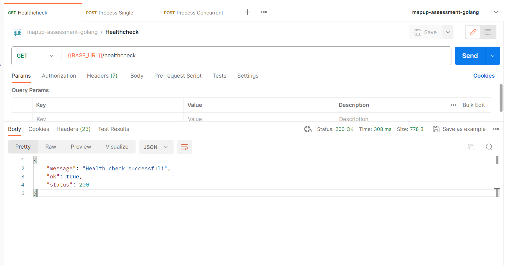
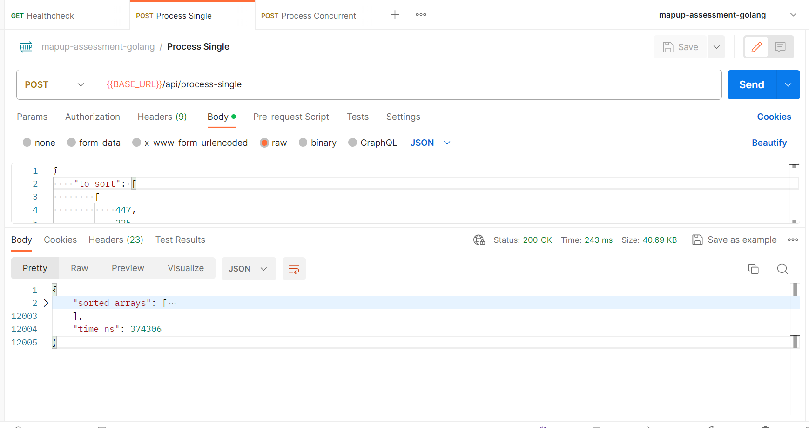
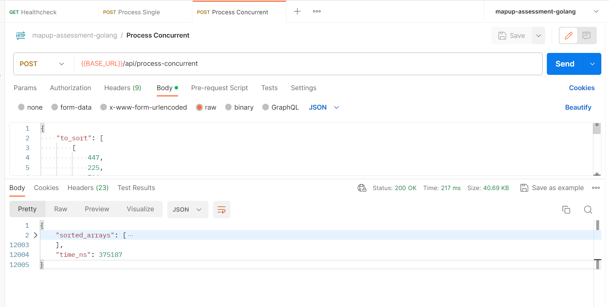

## Objective

Develop a Go server with two endpoints (/process-single and /process-concurrent) to demonstrate your skills in sequential and concurrent processing. The server should sort arrays provided in the request and return the time taken to execute the sorting in both sequential and concurrent manners.

To install and run the server, follow these steps:

```bash
git clone https://github.com/ritesh-15/mapup-assessment-golang.git
cd mapup-assessment-golang
go build -o main .
./main
```

### Request payload example

```
{
  "to_sort": [[3, 2, 1], [6, 5, 4], [9, 8, 7]]
}
```

### Response payload example

```
{
  "sorted_arrays": [[1, 2, 3], [4, 5, 6], [7, 8, 9]],
  "time_ns": 123456789
}

```

## Dockerization

```
docker build -t mapup-golang-server .
docker run -d -p 8080:8080 mapup-golang-server
```

## Remote Docker Image

```
docker pull riteshk15/mapup-golang-assessment
```

## Deployed Server URL 🚀

https://mapup-golang-server.onrender.com

## Routes

### Healthcheck

https://mapup-golang-server.onrender.com/healthcheck



### Process Sequential

https://mapup-golang-server.onrender.com/api/process-sequential



### Process Concurrent

https://mapup-golang-server.onrender.com/api/process-concurrent


